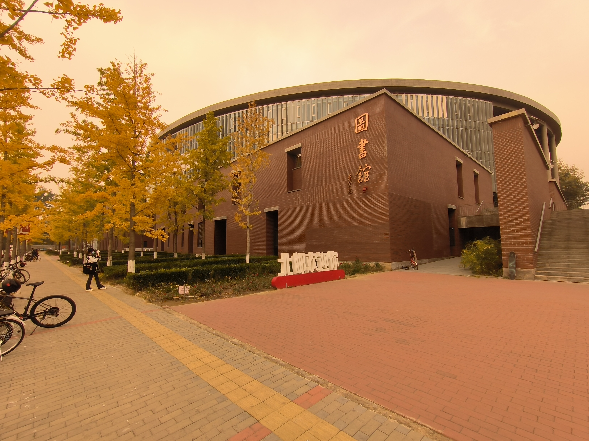

👋 Hi, I’m @MCJiu

👀 I’m interested in C/C++ and Python Programming.

🌱 I’m currently learning in Beijing University of Posts and Telecommunications (BUPT)

💞️ I developed [a simple minesweeper game](https://github.com/MCJiu/Minesweeper_GUI) this spring.

📫 How to reach me :  

- Through email: mctencent@gmail.com or mcjiu@bupt.edu.cn

[Click me to visit my blog (Chinese)](https://mcjiu.github.io/)

Gallery

- BUPT Library

- Nanhu, Changchun, Jilin Province

<!---
MCJiu/MCJiu is a ✨ special ✨ repository because its `README.md` (this file) appears on your GitHub profile.
You can click the Preview link to take a look at your changes.
--->
